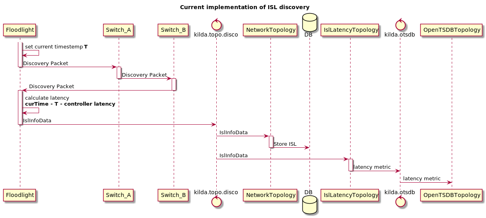
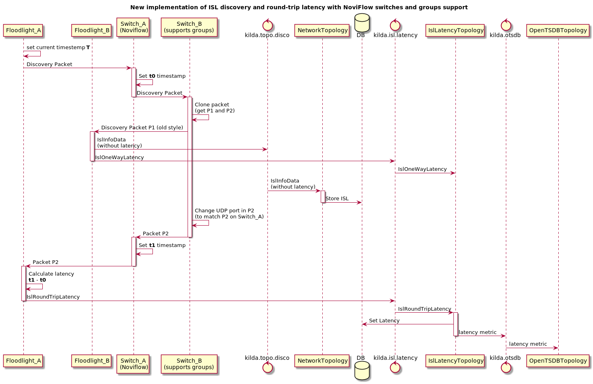
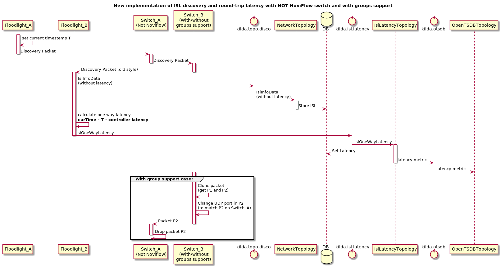

# Round trip latency

## Current implementation

In current implementation we measure latency from Switch A to Switch B by discovery packets.


## Round trip latency design with NoviFlow switches

The new way to measure round trip latency:

1) Send a discovery as a packet_out to switch A
2) Switch A put a timestamp t1 to the discovery packet and send it to switch B
3) Switch B receives the discovery packet and does 2 things: 
    * send it to the controller
    * modify packet (UDP port) and send it back to switch A (via group table)
4) Switch A receives his own message, add a timestamp t2 to it and send it to a controller.
5) Controller use the discovery packet from Switch B for ISL discovery purposes and store ISL in DB (without latency).
6) Controller use the discovery packet from Switch A for a roundtrip latency (t2-t1) measurement purposes:
    * Save ISL latency in DB
    * Send latency stats to OTSDB 



## Round trip latency design with NOT NoviFlow switch

Not NoviFlow switches can't store timestamps so the old way of latency measuring will be used for them.


## Storing latency in Neo4j Database

We can't update isl latency on each received latency packet. It's high load for Neo4j.
So we will collect latency for some period of time and update average latency in DB periodically. 
Two new config options were introduced for that purpose:

* `latency.update.interval` interval of sending new latency into DB
* `latency.update.time.range` interval of collecting latency to calculate average latency

## Structure of discovery packet

Two new LLDP TVL fields will be added to discovery packet to store T0 and T1 timestamps.
New discovery packet structure:

```
 0                   1                   2                   3                   4              
 0 1 2 3 4 5 6 7 8 9 0 1 2 3 4 5 6 7 8 9 0 1 2 3 4 5 6 7 8 9 0 1 2 3 4 5 6 7 8 9 0 1 2 3 4 5 6 7
+-+-+-+-+-+-+-+-+-+-+-+-+-+-+-+-+-+-+-+-+-+-+-+-+-+-+-+-+-+-+-+-+-+-+-+-+-+-+-+-+-+-+-+-+-+-+-+-+
|                                    Destination Mac Address                                    |
+-+-+-+-+-+-+-+-+-+-+-+-+-+-+-+-+-+-+-+-+-+-+-+-+-+-+-+-+-+-+-+-+-+-+-+-+-+-+-+-+-+-+-+-+-+-+-+-+
|                                       Source Mac Address                                      |
+-+-+-+-+-+-+-+-+-+-+-+-+-+-+-+-+-+-+-+-+-+-+-+-+-+-+-+-+-+-+-+-+-+-+-+-+-+-+-+-+-+-+-+-+-+-+-+-+
|           EtherType           |Version|  IHL  |Type of Service|          Total Length         |
+-+-+-+-+-+-+-+-+-+-+-+-+-+-+-+-+-+-+-+-+-+-+-+-+-+-+-+-+-+-+-+-+-+-+-+-+-+-+-+-+-+-+-+-+-+-+-+-+
|         Identification        |Flags|     Fragment Offset     |  Time to Live |    Protocol   |
+-+-+-+-+-+-+-+-+-+-+-+-+-+-+-+-+-+-+-+-+-+-+-+-+-+-+-+-+-+-+-+-+-+-+-+-+-+-+-+-+-+-+-+-+-+-+-+-+
|        Header Checksum        |                       Source IP Address                       |
+-+-+-+-+-+-+-+-+-+-+-+-+-+-+-+-+-+-+-+-+-+-+-+-+-+-+-+-+-+-+-+-+-+-+-+-+-+-+-+-+-+-+-+-+-+-+-+-+
|                     Destination IP Address                    |          Source Port          |
+-+-+-+-+-+-+-+-+-+-+-+-+-+-+-+-+-+-+-+-+-+-+-+-+-+-+-+-+-+-+-+-+-+-+-+-+-+-+-+-+-+-+-+-+-+-+-+-+
|        Destination Port       |             Length            |            Checksum           |
+-+-+-+-+-+-+-+-+-+-+-+-+-+-+-+-+-+-+-+-+-+-+-+-+-+-+-+-+-+-+-+-+-+-+-+-+-+-+-+-+-+-+-+-+-+-+-+-+
|ChasisID Type|      length     |                           Chassis Id                          |
+-+-+-+-+-+-+-+-+-+-+-+-+-+-+-+-+               +-+-+-+-+-+-+-+-+-+-+-+-+-+-+-+-+-+-+-+-+-+-+-+-+
|                                               | Port Id Type|      length     |               |
+-+-+-+-+-+-+-+-+-+-+-+-+-+-+-+-+-+-+-+-+-+-+-+-+-+-+-+-+-+-+-+-+-+-+-+-+-+-+-+-+-+-+-+-+-+-+-+-+
|              Port             |   TTL Type  |      length     |              TTL              |
+-+-+-+-+-+-+-+-+-+-+-+-+-+-+-+-+-+-+-+-+-+-+-+-+-+-+-+-+-+-+-+-+-+-+-+-+-+-+-+-+-+-+-+-+-+-+-+-+
|Optional Type|      length     |       Organizationally Unique Identifier      | Timestamp type|
+-+-+-+-+-+-+-+-+-+-+-+-+-+-+-+-+-+-+-+-+-+-+-+-+-+-+-+-+-+-+-+-+-+-+-+-+-+-+-+-+-+-+-+-+-+-+-+-+
|                                          Timestamp T0                                         |
+                               +-+-+-+-+-+-+-+-+-+-+-+-+-+-+-+-+-+-+-+-+-+-+-+-+-+-+-+-+-+-+-+-+
|                               |Optional Type|      length     |Organizationally Unique Identi.|
+-+-+-+-+-+-+-+-+-+-+-+-+-+-+-+-+-+-+-+-+-+-+-+-+-+-+-+-+-+-+-+-+-+-+-+-+-+-+-+-+-+-+-+-+-+-+-+-+
|               | Timestamp type|                          Timestamp T1                         |
+-+-+-+-+-+-+-+-+-+-+-+-+-+-+-+-+                               +-+-+-+-+-+-+-+-+-+-+-+-+-+-+-+-+
|                                                               |Optional Type|      length     |
+-+-+-+-+-+-+-+-+-+-+-+-+-+-+-+-+-+-+-+-+-+-+-+-+-+-+-+-+-+-+-+-+-+-+-+-+-+-+-+-+-+-+-+-+-+-+-+-+
|       Organizationally Unique Identifier      | SwitchId type |                               |
+-+-+-+-+-+-+-+-+-+-+-+-+-+-+-+-+-+-+-+-+-+-+-+-+-+-+-+-+-+-+-+-+                               +
|                                          Datapath ID                                          |
+-+-+-+-+-+-+-+-+-+-+-+-+-+-+-+-+-+-+-+-+-+-+-+-+-+-+-+-+-+-+-+-+-+-+-+-+-+-+-+-+-+-+-+-+-+-+-+-+
|Optional Type|      length     |       Organizationally Unique Identifier      | Timestamp type|
+-+-+-+-+-+-+-+-+-+-+-+-+-+-+-+-+-+-+-+-+-+-+-+-+-+-+-+-+-+-+-+-+-+-+-+-+-+-+-+-+-+-+-+-+-+-+-+-+
|                                      Floodlight Timestamp                                     |
+                               +-+-+-+-+-+-+-+-+-+-+-+-+-+-+-+-+-+-+-+-+-+-+-+-+-+-+-+-+-+-+-+-+
|                               |Optional Type|      length     |Organizationally Unique Identi.|
+-+-+-+-+-+-+-+-+-+-+-+-+-+-+-+-+-+-+-+-+-+-+-+-+-+-+-+-+-+-+-+-+-+-+-+-+-+-+-+-+-+-+-+-+-+-+-+-+
|               |  Ordinal type |                            Ordinal                            |
+-+-+-+-+-+-+-+-+-+-+-+-+-+-+-+-+-+-+-+-+-+-+-+-+-+-+-+-+-+-+-+-+-+-+-+-+-+-+-+-+-+-+-+-+-+-+-+-+
|Optional Type|      length     |       Organizationally Unique Identifier      |   Sigh type   |
+-+-+-+-+-+-+-+-+-+-+-+-+-+-+-+-+-+-+-+-+-+-+-+-+-+-+-+-+-+-+-+-+-+-+-+-+-+-+-+-+-+-+-+-+-+-+-+-+
|                                                                                               |
+                                                                                               +
|                                             Token                                             |
+                                                                     +-+-+-+-+-+-+-+-+-+-+-+-+-+
|                                                                     |       End of LLDP       |
+-+-+-+-+-+-+-+-+-+-+-+-+-+-+-+-+-+-+-+-+-+-+-+-+-+-+-+-+-+-+-+-+-+-+-+-+-+-+-+-+-+-+-+-+-+-+-+-+
|     |
+-+-+-+
```

**NOTE:** This structure was generated be script from file `generate_packet_structure.sh`
