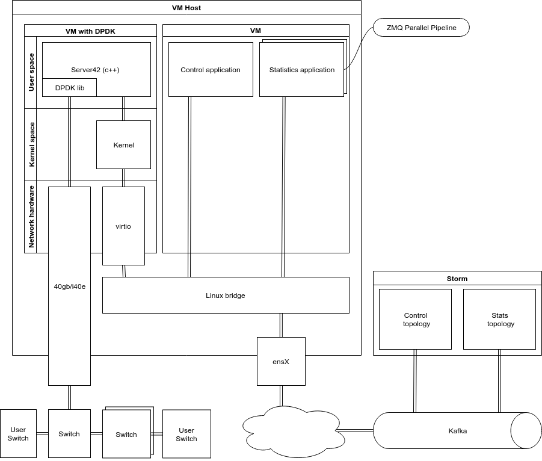
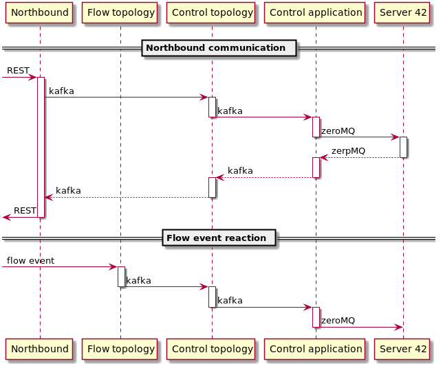
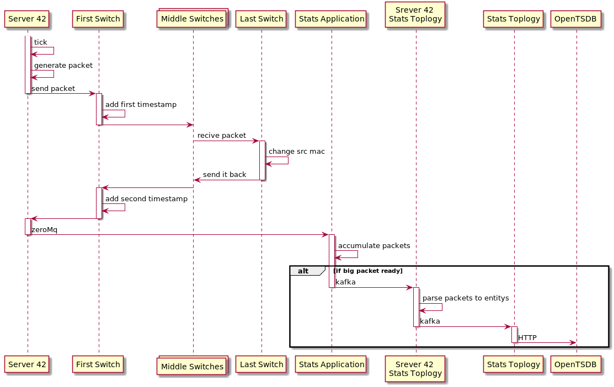

# Server 42 Project mk 1

## Description

On April we had a long and hard discussion related to a big problem. How to minimize PACKET_IN PACKET_OUT OpenFlow instruction on Floodlight? That instructions do a huge load on Floodlight and lower our ability to make the truly scalable controller. Даже solution with multi Floodlight doesn't fit our requirements. We want a generate and parse a massive bunch of packets per second. One of the issues it's sent two packets per second for each flow in both directions for sub-second latency measurement. In the future, we want a lot of features from that project and the first name - telemetry server is not fit. So, for now, the name will be Server 42.

## First feature - Latency measurement for flow
### Description
We want to know that traffic flow through user flow in sub-second perspective and have latency in our OpenTSDB database. For solving that we create an application based on real fast packet crafting and parsing solution - [DPDK](https://doc.dpdk.org/guides/linux_gsg/index.html). DPDK give as the ability to create 11b packet per second because it does not use Linux network kernel drivers. A server42 written on c++ and contain minimum code for generating and parse packets. Long story short we create packet and send it to switch, on switch we add server timestamp and mix it to customer traffic on flow then we hook it on the last switch and send it back to flow, when it appears on the first switch we put another timestamp to it and redirect it to application, application parse packet and in that point we know 2 thing. First is flow alive and round trip latency. Then we send that information to OpenTSDB. 
### Requirements
*TBD*
### Hardware
*TBD*
### Deployment diagram

- Server 42 application written on c++ and DPDK library. Responsibility is create\parse packets and sends that information to the Stats application.
- Stats application is written on java. Responsibility: collect information from server 42 pack all messages to big(1mb) Kafka message and send it to Stats Topology via Kafka queue. Must поддерживать more than one copy for scaling.
- Stats storm topology is written on java. Responsibility: Get big data packet from Stats application parse it and put the information to OpenTSDB
-  Control application is written on java. Responsibility: Control plane application for adding\removing flow on server 42 and provide all others control features.
-  Control storm topology is written on java. Responsibility: get a request from NB, and other topologies also add new OpenFlow rules to switches via Floodlight.
#### DPDK setup
- <https://doc.dpdk.org/guides/linux_gsg/linux_drivers.html>
- <https://pktgen-dpdk.readthedocs.io/en/latest/getting_started.html>
#### DPDK core binding
VM with Server 42 must be bound to 3 dedicated hardware CPUs in one numa group.
### Communication
All communication between Control and Stat application operated by Kafka with google protocol buffers. Communication with server 42 handled by zeroMq as transport and google protocol buffers.
### Seq diagram
#### Control Plane

#### Packet and Stats processing

### API
#### Server42 API
*TBD*
#### Stats API
*TBD*
#### Control API
*TBD*
#### NB API
*TBD*

### Packet Format and mac limitation
Src mac must be real address of a device

*TBD* - format
### Rules on a switch
Rules for switches is similar for current round trip latency on isl feature

*TBD* - list of rules 
### Monitoring
All Server 42 application must have a Prometheus endpoint to collect statistics and other telemetry information.
### Plan
#### Server 42
- Send packets
- Parse packets
- Control Plane
- Prometheus endpoint
- Send collected data to stats
#### Control application
- Get control instructions
- Response on control instruction requests
- Prometheus endpoint
#### Control topology
- Get control instructions
- Response on control instruction responses
- Prometheus endpoint
- Sync all flow on startup
- Add flow to monitor on flow creation
- React of delete\reroute\update flow
- Send to FL command install all rules необходимых для работы
- Update FL to handle commands for switch rules install
- Install rules on switches on startup
#### Stats applications
- Pack data from server42 to big packet
- Send data to Kafka
- Prometheus endpoint
#### Stats topology
- Get a big packet of telemetry info
- Send information to OpenTSDB
#### Deploy
- Write Jenkins jobs to deploy applications to host machine
#### Tests
- All code must be covered with unit test
- All functions must be covered with functional tests
- Modify\create all-in-one deployment for fit that functional

### High load spike
I created two DPDK application for proof of concept. That application can generate\process 11b packet per second and that over 11 times more than we need. First application server42 generate packets and send them to a second echo-server application. An echo-server application receives packets then modify it and send it back to server42 for emulation real switch behavior.

### Zero downtime deployment
That is tricky because we use pass-through PCI device directly to VM with DPDK. To solve that I propose to use two network card and two links to switch. In that setup, we can run a new VM with DPDK on free ethernet device and then shutdown VM with old code. For separate old VMs with new VMs, I propose to use Linux network namespaces. That gives us the ability don't play with IP:PORT for each service. One of the pluses of that we don't need a create a сложный cod in applications and that simplify entire codebase also if users of kilda don't need ZDD they just don't set up that. 
